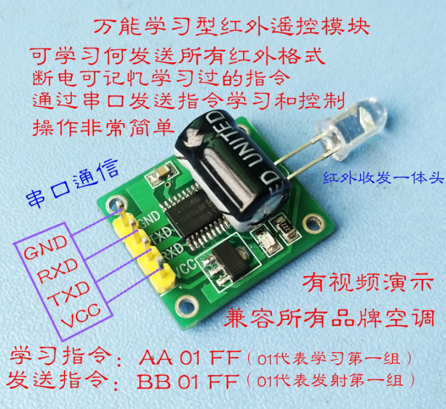

# iot-infrared-remote-controller

## IR module

* 3.3V/5V 都可使用
* 9600-8-n-1

這個模組已經具備學習和發送功能了。所以你只需要再接一個 MCU 做指令的發送即可。

它提供兩組指令的學習和發送:

| # |   Learn  |   Send   |
|---|----------|----------|
| 1 | AA 01 FF | BB 01 FF |
| 2 | AA 02 FF | BB 02 FF |

